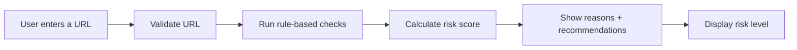
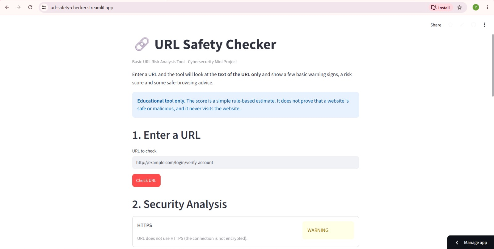
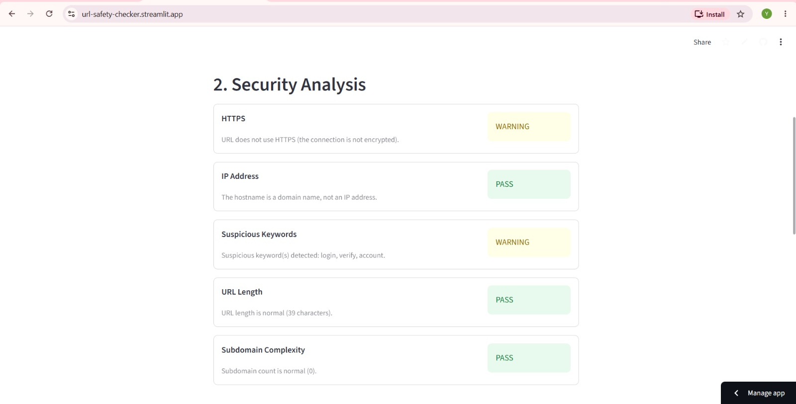
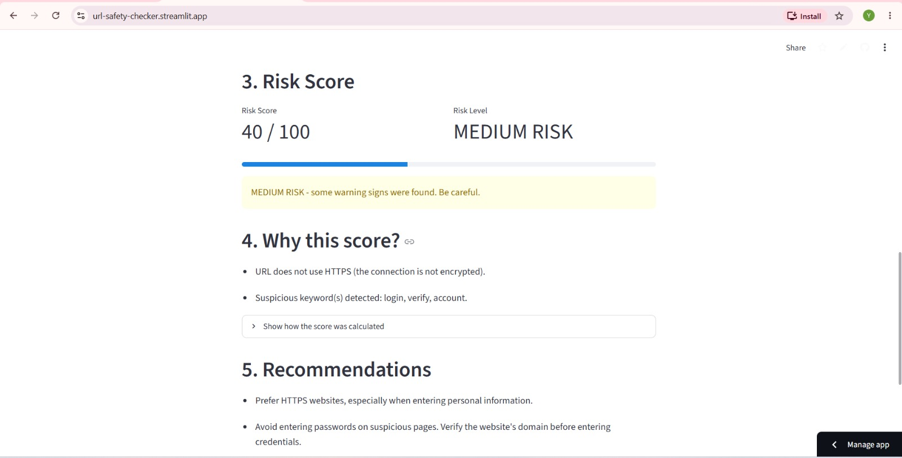
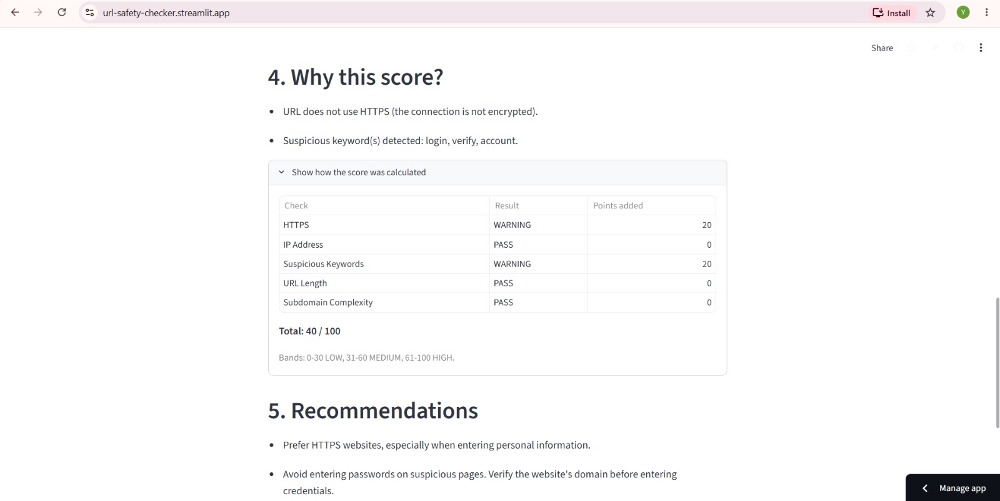
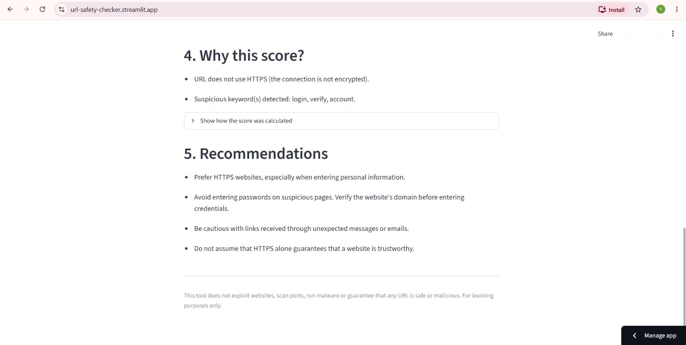

# URL Safety Checker

A beginner-friendly cybersecurity mini project built with Python and Streamlit.
The app accepts a URL, runs a small set of rule-based checks against the URL text, and then shows a risk score, risk level, reasons, and safe-browsing recommendations.

> Educational tool only. The score is not a probability of malware and does not guarantee a website is safe or malicious.

## Live Demo

- Streamlit App: https://url-safety-checker.streamlit.app/

## Objectives

- Understand warning signs commonly seen in phishing-style URLs.
- Apply simple rule-based analysis using Python.
- Explain risk decisions with clear reasons instead of a vague safe/dangerous verdict.
- Practise safer browsing habits.

## Features

- URL input box and Check URL button in Streamlit
- URL validation that shows errors without crashing the app
- Five checks:
  - HTTPS enforcement
  - IP address in hostname
  - Suspicious keywords
  - URL length
  - Subdomain complexity
- Risk score from 0–100 with LOW / MEDIUM / HIGH levels
- Human-readable reasons and a calculation breakdown table
- Defensive safe-browsing recommendations
- 19 unit tests that never open any website

## Workflow Diagram



## Screenshots

The following screenshots show the analysis of the example URL:

`http://192.168.1.10/login/verify-account`











## Technology Used

- Python 3.x
- Streamlit
- Python standard library: `re`, `urllib.parse`, `dataclasses`, `unittest`

## Project Structure

```text
URL-Safety-Checker/
├── app.py                  # Streamlit user interface
├── url_checker.py          # Analysis and scoring logic
├── requirements.txt        # streamlit>=1.30
├── README.md
├── screenshots/
│   ├── url-input.png
│   ├── high-risk-result.png
│   ├── detected-reasons.png
│   ├── score-calculation.png
│   └── recommendations.png
├── docs/
│   ├── PROJECT_PROPOSAL.md
│   ├── PROJECT_REQUIREMENTS.md
│   ├── SYSTEM_DESIGN.md
│   ├── TEST_CASES.md
│   └── DEMONSTRATION.md
├── tests/
    └── test_url_checker.py
```

## Installation

```bash
python -m venv .venv
```

Activate the environment:

- Windows: `.venv\Scripts\activate`
- macOS / Linux: `source .venv/bin/activate`

Install dependencies:

```bash
pip install -r requirements.txt
```

## How to Run

```bash
streamlit run app.py
```

Your browser should open the app at `http://localhost:8501`.

## How the Risk Score Works

Each warning adds points. The total is capped between 0 and 100. All values are constants at the top of `url_checker.py` and can be changed easily.

| Check | Warning condition | Points |
| --- | --- | ---: |
| HTTPS | URL does not use HTTPS | 20 |
| IP Address | Hostname is an IPv4 address | 30 |
| Suspicious Keywords | Contains login, verify, account, password, security, update, confirm | 10 per keyword, max 20 |
| URL Length | More than 75 characters | 15 |
| Subdomain Complexity | More than 2 subdomains | 15 |

| Score | Risk Level |
| --- | --- |
| 0–30 | LOW RISK |
| 31–60 | MEDIUM RISK |
| 61–100 | HIGH RISK |

The weights add up to 100, but the highest score you can actually reach is 85 because an IP-address hostname has no subdomains.

## Example Demonstration

| URL | Score | Level |
| --- | ---: | --- |
| `https://example.com` | 0 | LOW RISK |
| `http://example.com` | 20 | LOW RISK |
| `https://login.account.security.example.com` | 35 | MEDIUM RISK |
| `http://192.168.1.10/login` | 60 | MEDIUM RISK |
| `http://192.168.1.10/login/verify-account` | 70 | HIGH RISK |

See `docs/DEMONSTRATION_AND_VIVA.md` for the full demonstration sequence.

## Testing

```bash
python -m unittest discover -s tests -v
```

`pytest` also works if it is installed. The tests check the logic only and never visit a website.

## Limitations

- The tool looks only at the text of the URL; it does not inspect page content, certificates, domain age, or blacklists.
- Keyword matching is simple: a safe URL containing "login" may still be flagged, while a malicious URL with no matching keywords may not be.
- Subdomains are counted naively and do not handle multi-part endings like `.co.uk`.
- Only IPv4 is detected; IPv6 and number-encoded IPs are not handled.
- Only `http://` and `https://` URLs are accepted; hostnames like `localhost` are rejected as invalid.
- The score is educational and not a real-world probability.

This project does not exploit websites, scan ports, execute malware, attempt unauthorized access, or visit the URLs it analyzes.

## Future Improvements

- Detect IPv6 addresses and handle multi-part domain endings
- Add more checks such as `@` symbols, excessive hyphens, or look-alike characters
- Let the user edit the keyword list in the interface
- Save a history of checked URLs
